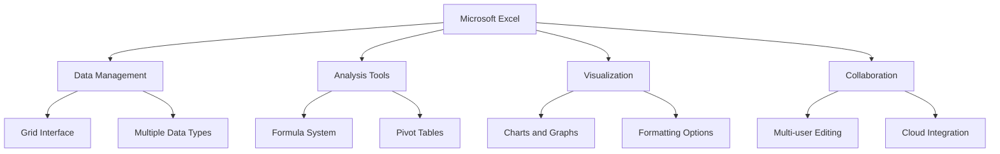
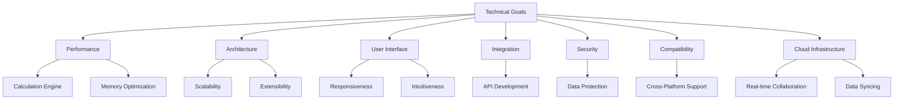
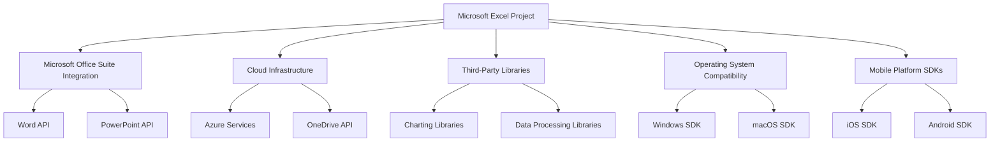
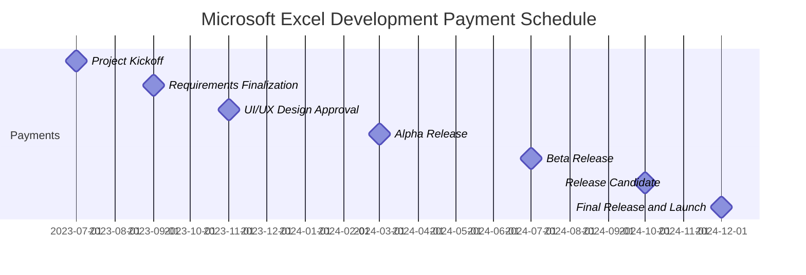
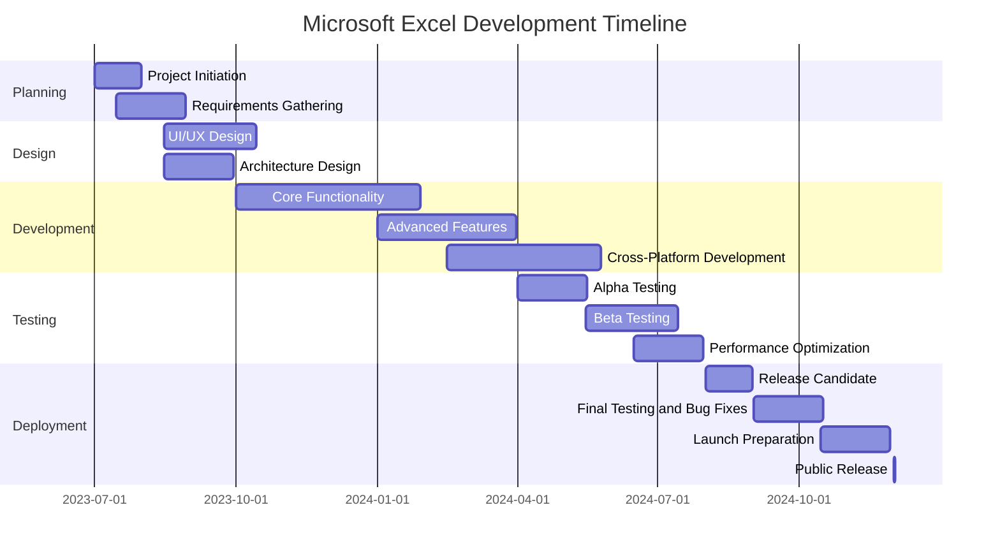
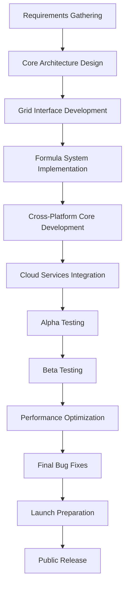
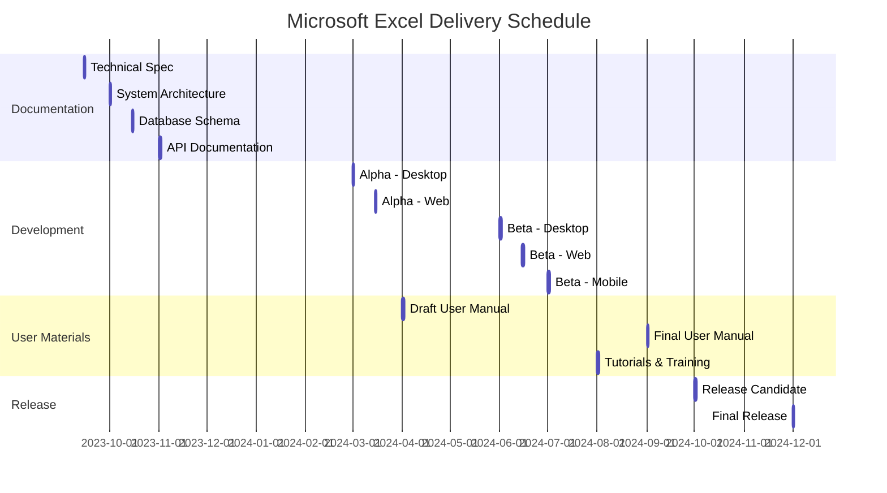

# EXECUTIVE SUMMARY

## PROJECT OVERVIEW

Microsoft Excel is a revolutionary spreadsheet software application designed to transform the way individuals and businesses organize, analyze, and visualize data. In response to the growing need for powerful yet user-friendly data management tools, Excel offers a comprehensive solution that combines intuitive design with advanced functionality. The software addresses the client's need for efficient data handling, complex calculations, and insightful data representation, all within a single, integrated platform.

## OBJECTIVES

1. Develop a robust, grid-based interface for seamless data input and manipulation
2. Implement a comprehensive formula system supporting complex calculations and data analysis
3. Create advanced charting and graphing capabilities for effective data visualization
4. Design an intuitive, ribbon-style toolbar to enhance user experience for both beginners and power users
5. Ensure cross-platform compatibility (Windows, macOS, web, and mobile)
6. Integrate cloud storage and syncing for seamless access across devices
7. Implement collaboration features to support multiple users working simultaneously

## VALUE PROPOSITION

Our agency offers unparalleled expertise in developing sophisticated software solutions that balance power with accessibility. For Microsoft Excel, we bring:

1. Deep understanding of user needs across various proficiency levels
2. Expertise in creating scalable, high-performance applications capable of handling large datasets
3. Experience in developing cross-platform solutions with seamless integration
4. Strong focus on user interface design, ensuring intuitive navigation and feature discovery
5. Proven track record in implementing robust calculation engines and data analysis tools
6. Commitment to ongoing support and feature enhancement based on user feedback and evolving market needs

## PROJECT OBJECTIVES

### BUSINESS GOALS

1. Establish Microsoft Excel as the industry-leading spreadsheet application
2. Increase market share in the productivity software sector
3. Enhance user productivity and efficiency across various industries
4. Drive adoption of the Microsoft Office suite through Excel's integration
5. Generate recurring revenue through subscription-based licensing models
6. Expand the user base by catering to both novice and advanced users
7. Foster a robust ecosystem of third-party add-ins and integrations

### TECHNICAL GOALS

1. Develop a high-performance calculation engine capable of handling large datasets
2. Implement a scalable and extensible architecture to support future feature additions
3. Create a responsive and intuitive user interface across all supported platforms
4. Optimize memory usage and processing efficiency for improved performance
5. Develop a comprehensive API for seamless integration with other applications
6. Implement robust data security measures to protect sensitive information
7. Ensure cross-platform compatibility (Windows, macOS, web, and mobile)
8. Develop a cloud-based infrastructure for real-time collaboration and data syncing

### SUCCESS CRITERIA

| Criterion | Target | Measurement Method |
|-----------|--------|---------------------|
| Market Share | Increase by 15% within 2 years | Industry reports and sales data |
| User Adoption | 50 million active users within 1 year | User account metrics and usage statistics |
| Performance | 99.9% uptime | System monitoring tools |
| Calculation Speed | Process 1 million cells in < 5 seconds | Automated performance testing |
| User Satisfaction | 90% positive feedback | User surveys and app store ratings |
| Cross-Platform Usage | 30% of users accessing from multiple devices | User analytics data |
| Third-Party Integrations | 500 approved add-ins within 1 year | Add-in marketplace metrics |
| Data Processing Capacity | Handle workbooks up to 1GB in size | Quality assurance testing |
| Collaboration | 25% of users engaging in shared workbooks | Usage analytics |
| Revenue Growth | 20% year-over-year increase | Financial reports |
| Feature Utilization | 70% of features used by 30% of users | In-app usage tracking |
| Load Time | < 3 seconds on standard hardware | Performance benchmarking |
| Mobile Usage | 25% of total usage from mobile devices | Platform usage analytics |
| Error Rate | < 0.1% in calculations | Automated testing and user error reports |
| Training Efficiency | 80% of new users proficient in basic features within 2 hours | User onboarding analytics and surveys |

# SCOPE OF WORK

## IN-SCOPE

1. User Interface Development
   - Grid-based interface for data input and manipulation
   - Ribbon-style toolbar for easy access to features
   - Customizable quick access toolbar
   - Cell, row, and column formatting options
   - Multiple worksheet support within a single workbook

2. Data Management and Analysis
   - Support for various data types (numbers, text, dates, currencies)
   - Comprehensive formula system with 400+ built-in functions
   - Sorting and filtering capabilities
   - Pivot table functionality for data summarization
   - Data validation tools

3. Visualization Features
   - Charting and graphing tools with 20+ chart types
   - Conditional formatting options
   - Sparklines for in-cell mini charts

4. Advanced Functionality
   - Macro recording and VBA support for automation
   - What-if analysis tools (Goal Seek, Scenario Manager, Data Tables)
   - Solver add-in for complex optimization problems

5. Collaboration and Sharing
   - Real-time co-authoring capabilities
   - Comments and review features
   - Sharing options with customizable permissions

6. Cross-Platform Development
   - Windows desktop application
   - macOS desktop application
   - Web-based version
   - Mobile applications for iOS and Android

7. Integration and Compatibility
   - Seamless integration with other Microsoft Office applications
   - Import/Export functionality for various file formats (CSV, XML, PDF)
   - API development for third-party integrations

8. Performance Optimization
   - Large dataset handling (up to 1 million rows)
   - Multithreading support for faster calculations
   - Memory usage optimization

9. Cloud Services
   - OneDrive integration for cloud storage
   - Automatic saving and version history
   - Cross-device syncing

10. Security Features
    - Workbook and worksheet protection options
    - Data encryption for sensitive information
    - Multi-factor authentication support

## OUT-OF-SCOPE

1. Database management system functionality
2. Advanced statistical analysis tools beyond basic statistical functions
3. Full-fledged project management features
4. Direct integration with non-Microsoft cloud storage services
5. Built-in machine learning or AI capabilities
6. Custom font development
7. Hardware-specific optimizations beyond standard system requirements
8. Integrated email client functionality
9. Built-in language translation services
10. Blockchain or cryptocurrency-related features

## ASSUMPTIONS

1. Microsoft will provide necessary access to existing codebase and documentation
2. The project team will have access to required development tools and environments
3. Necessary licenses for third-party components will be obtained in a timely manner
4. User testing groups will be available for feedback during development phases
5. Cloud infrastructure will be available and scalable to support the application
6. Existing Microsoft account system can be leveraged for user authentication
7. The current Microsoft Office suite API will remain stable during development
8. Mobile device manufacturers will continue to support current OS versions
9. Regulatory compliance requirements will not significantly change during development
10. Sufficient bandwidth will be available for cloud-based features and updates

## DEPENDENCIES

| Dependency | Description | Potential Impact |
|------------|-------------|-------------------|
| Microsoft Office Suite | Integration with Word, PowerPoint, etc. | Delays in API updates could affect feature parity |
| Cloud Infrastructure | Azure services for hosting and data management | Service disruptions could impact cloud-based features |
| Third-Party Libraries | External libraries for charting, data processing | Version conflicts or deprecations may require code adjustments |
| Operating System Compatibility | Windows and macOS SDKs | OS updates might necessitate application modifications |
| Mobile Platform SDKs | iOS and Android development kits | Platform policy changes could affect mobile app features |
| Web Technologies | HTML5, CSS3, JavaScript frameworks | Web standards evolution may require ongoing updates |
| Calculation Engine | Core component for formula processing | Performance issues could delay release or impact user experience |
| User Authentication System | Microsoft account integration | Changes in authentication protocols may require security updates |
| Localization Services | Language and region-specific content | Delays in translation could affect international releases |
| Hardware Compatibility | Varied user devices and specifications | New hardware features may require additional development for optimization |

# BUDGET AND COST ESTIMATES

## COST BREAKDOWN

| Category | Description | Cost (USD) |
|----------|-------------|------------|
| Labor | Development team (20 developers x 18 months) | $7,200,000 |
| | UI/UX designers (5 designers x 18 months) | $900,000 |
| | Project managers (3 managers x 18 months) | $810,000 |
| | Quality Assurance team (10 testers x 18 months) | $1,620,000 |
| | DevOps engineers (5 engineers x 18 months) | $1,350,000 |
| Software and Tools | Development environments and licenses | $500,000 |
| | Third-party libraries and components | $300,000 |
| Infrastructure | Cloud services and hosting (development and testing) | $750,000 |
| | On-premise servers and networking equipment | $400,000 |
| User Research and Testing | Focus groups and usability studies | $250,000 |
| | Beta testing program | $150,000 |
| Training and Documentation | Internal team training | $100,000 |
| | User documentation and help system development | $200,000 |
| Marketing and Launch | Pre-launch marketing campaign | $1,000,000 |
| | Launch event and materials | $500,000 |
| Contingency | 10% of total budget for unforeseen expenses | $1,603,000 |
| **Total** | | **$17,633,000** |

## PAYMENT SCHEDULE

| Milestone | Deliverable | Payment Percentage | Amount (USD) |
|-----------|-------------|---------------------|--------------|
| Project Kickoff | Signed contract and initial project plan | 10% | $1,763,300 |
| Requirements Finalization | Approved requirements document | 15% | $2,644,950 |
| UI/UX Design Approval | Finalized design mockups and prototypes | 10% | $1,763,300 |
| Alpha Release | Core functionality implemented | 20% | $3,526,600 |
| Beta Release | Feature-complete version for testing | 20% | $3,526,600 |
| Release Candidate | Fully tested version ready for final approval | 15% | $2,644,950 |
| Final Release and Launch | Public release of Microsoft Excel | 10% | $1,763,300 |

## BUDGET CONSIDERATIONS

1. **Technology Changes**: Rapid advancements in web technologies or mobile platforms may require additional development efforts or tool acquisitions. We have allocated a portion of the contingency budget to address potential technology shifts.

2. **Scope Creep**: As the project progresses, there may be requests for additional features or functionality. We will manage this through strict change control processes and clear communication with stakeholders about the impact on budget and timeline.

3. **Performance Optimization**: Achieving the desired performance levels for large datasets may require additional resources or specialized expertise. We have budgeted for performance testing and optimization, but complex issues may necessitate additional investment.

4. **Third-Party Integration Challenges**: Integrating with external services or APIs may present unforeseen difficulties. We have allocated time and resources for integration work, but complex issues may require additional effort.

5. **Cybersecurity Measures**: Evolving security threats may necessitate additional security features or audits. We have included a budget for security testing and implementation but may need to adjust based on emerging threats.

6. **Cloud Infrastructure Costs**: While we have estimated cloud usage costs, actual usage during development and testing may vary. We will closely monitor cloud spending and optimize resource allocation to manage costs.

7. **Localization Expenses**: Adapting Excel for multiple languages and regions may incur additional translation and cultural adaptation costs. We have budgeted for major languages, but expansion to more locales may require additional investment.

8. **Regulatory Compliance**: Changes in data protection laws or industry standards may require additional development work to ensure compliance. We have allocated resources for compliance, but significant regulatory changes may impact the budget.

9. **User Testing Feedback**: Extensive user testing may reveal the need for significant UI/UX changes or additional features. We have budgeted for multiple design iterations, but major overhauls could impact the timeline and budget.

10. **Market Competition**: Rapid innovations by competitors may necessitate the addition of new features to remain competitive. We will monitor the market closely and may need to reallocate resources to address competitive pressures.

To mitigate these risks, we will:
- Conduct regular budget reviews and forecasts
- Maintain open communication channels with all stakeholders
- Implement a robust change management process
- Continuously monitor industry trends and technological advancements
- Prioritize features and functionality to ensure core requirements are met within budget

# TIMELINE AND MILESTONES

## PROJECT TIMELINE

## KEY MILESTONES

| Milestone | Description | Target Date |
|-----------|-------------|-------------|
| Project Kickoff | Official start of the project | 2023-07-01 |
| Requirements Finalization | Completion of requirements gathering and analysis | 2023-08-30 |
| Design Approval | Finalization of UI/UX and architecture design | 2023-10-15 |
| Core Functionality Complete | Basic spreadsheet features implemented | 2024-01-30 |
| Advanced Features Integration | Complex calculations, pivot tables, and macros implemented | 2024-03-30 |
| Cross-Platform Alpha | Initial versions available on all target platforms | 2024-05-25 |
| Alpha Release | Internal testing of feature-complete version | 2024-05-15 |
| Beta Release | External user testing begins | 2024-07-15 |
| Performance Benchmarks Met | Application meets or exceeds performance targets | 2024-07-30 |
| Release Candidate | Feature-frozen version for final testing | 2024-08-30 |
| Final Build Approval | Management sign-off on the release version | 2024-10-15 |
| Public Release | Official launch of Microsoft Excel | 2024-12-01 |

## CRITICAL PATH

The following tasks represent the critical path for the Microsoft Excel project. Any delays in these tasks will directly impact the project's completion date:

1. Requirements Gathering and Analysis
2. Core Architecture Design
3. Development of Grid Interface and Basic Data Handling
4. Implementation of Formula System
5. Cross-Platform Core Development
6. Integration of Cloud Services and Collaboration Features
7. Alpha and Beta Testing Phases
8. Performance Optimization
9. Final Bug Fixes and Stability Improvements
10. Launch Preparation and Deployment

To maintain the project schedule, these critical path items will be closely monitored and prioritized. Resources will be allocated to ensure these tasks are completed on time, and any potential delays will be addressed immediately to mitigate impact on the overall project timeline.

# DELIVERABLES

## LIST OF DELIVERABLES

1. Software Components
   - Microsoft Excel Desktop Application (Windows and macOS)
   - Microsoft Excel Web Application
   - Microsoft Excel Mobile Applications (iOS and Android)
   - Excel API for third-party integrations

2. Documentation
   - Technical Specification Document
   - User Manual
   - API Documentation
   - System Architecture Document
   - Database Schema Documentation
   - Security and Compliance Documentation

3. Training Materials
   - Video Tutorials
   - Interactive Online Training Modules
   - Quick Start Guide
   - Advanced User Guide
   - Administrator Guide

4. Testing and Quality Assurance
   - Test Plans and Test Cases
   - Bug Reports and Resolution Documentation
   - Performance Benchmark Reports

5. Deployment and Maintenance
   - Deployment Guide
   - Maintenance and Troubleshooting Guide
   - Disaster Recovery Plan

6. Marketing and Support Materials
   - Product Brochures and Data Sheets
   - FAQs and Knowledge Base Articles
   - Release Notes for Each Version

## DELIVERY SCHEDULE

| Deliverable | Expected Completion Date |
|-------------|--------------------------|
| Technical Specification Document | 2023-09-15 |
| System Architecture Document | 2023-10-01 |
| Database Schema Documentation | 2023-10-15 |
| API Documentation (Initial Version) | 2023-11-01 |
| Test Plans and Test Cases | 2023-12-01 |
| Alpha Version - Desktop Application | 2024-03-01 |
| Alpha Version - Web Application | 2024-03-15 |
| User Manual (Draft) | 2024-04-01 |
| Beta Version - Desktop Application | 2024-06-01 |
| Beta Version - Web Application | 2024-06-15 |
| Beta Version - Mobile Applications | 2024-07-01 |
| Performance Benchmark Reports | 2024-07-15 |
| Video Tutorials and Training Modules | 2024-08-01 |
| Final User Manual | 2024-09-01 |
| Deployment Guide | 2024-09-15 |
| Release Candidate - All Platforms | 2024-10-01 |
| Marketing Materials | 2024-10-15 |
| Final Release - All Platforms | 2024-12-01 |

## ACCEPTANCE CRITERIA

1. Software Components
   - All specified features are fully functional
   - Performance benchmarks are met (e.g., handling 1 million rows in < 5 seconds)
   - Cross-platform compatibility is verified
   - No critical or high-priority bugs are present
   - User interface is consistent across all platforms
   - Accessibility standards are met

2. Documentation
   - All documents are complete, accurate, and up-to-date
   - Technical specifications align with the delivered software
   - User manual covers all features and common use cases
   - API documentation is comprehensive and includes examples

3. Training Materials
   - Video tutorials cover all major features
   - Training modules are interactive and engaging
   - Quick Start Guide enables new users to become productive within 2 hours

4. Testing and Quality Assurance
   - Test coverage exceeds 90% for critical components
   - All test cases pass in the final release
   - Performance tests show improvement over previous versions

5. Deployment and Maintenance
   - Deployment can be completed within specified timeframe
   - Disaster recovery plan successfully tested

6. Marketing and Support Materials
   - Materials accurately represent the product features
   - FAQs cover common user questions and issues

| Deliverable Category | Acceptance Criteria |
|----------------------|---------------------|
| Software Components | - All features functional - Performance benchmarks met - Cross-platform compatibility - No critical bugs - Consistent UI - Accessibility compliance |
| Documentation | - Complete and accurate - Aligned with software - Comprehensive coverage |
| Training Materials | - Cover all major features - Interactive and engaging - Enable quick user proficiency |
| Testing and QA | - High test coverage - All tests passing - Performance improvements demonstrated |
| Deployment and Maintenance | - Smooth deployment process - Effective disaster recovery |
| Marketing and Support | - Accurate representation - Comprehensive FAQs |

Each deliverable will be reviewed against these criteria by the project team and client representatives. Formal acceptance will require sign-off from designated stakeholders, confirming that all criteria have been met satisfactorily.