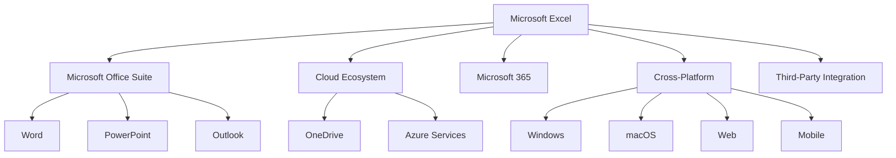
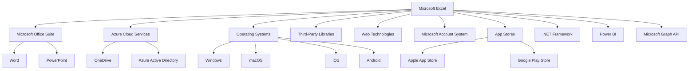
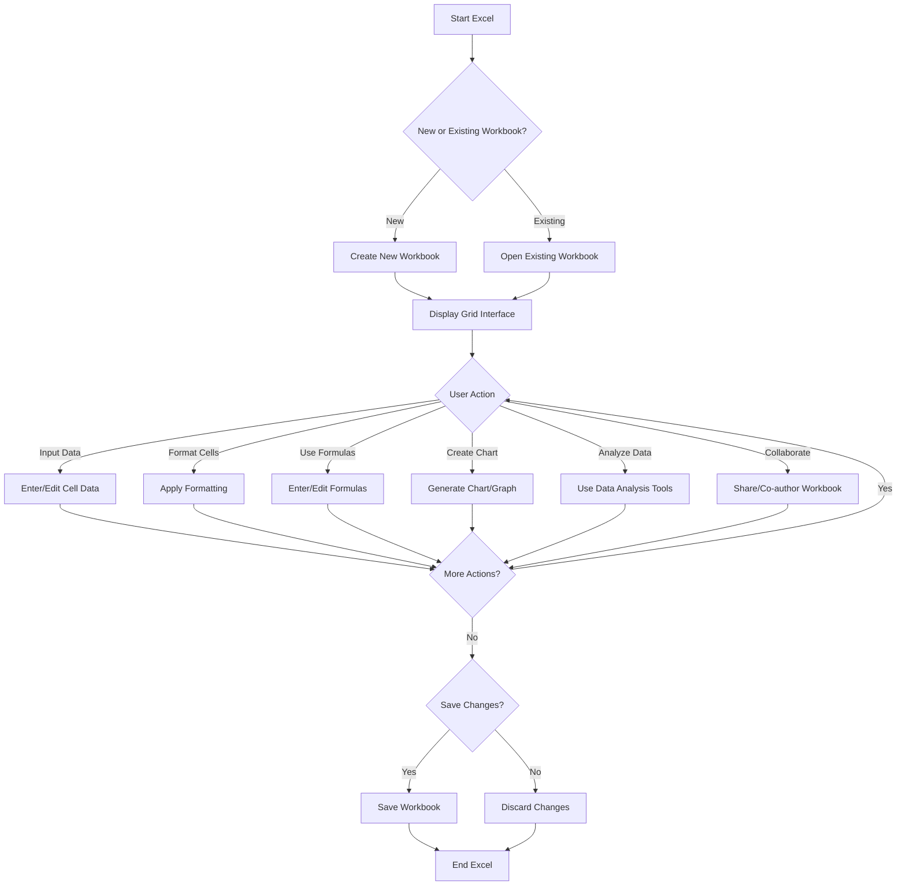
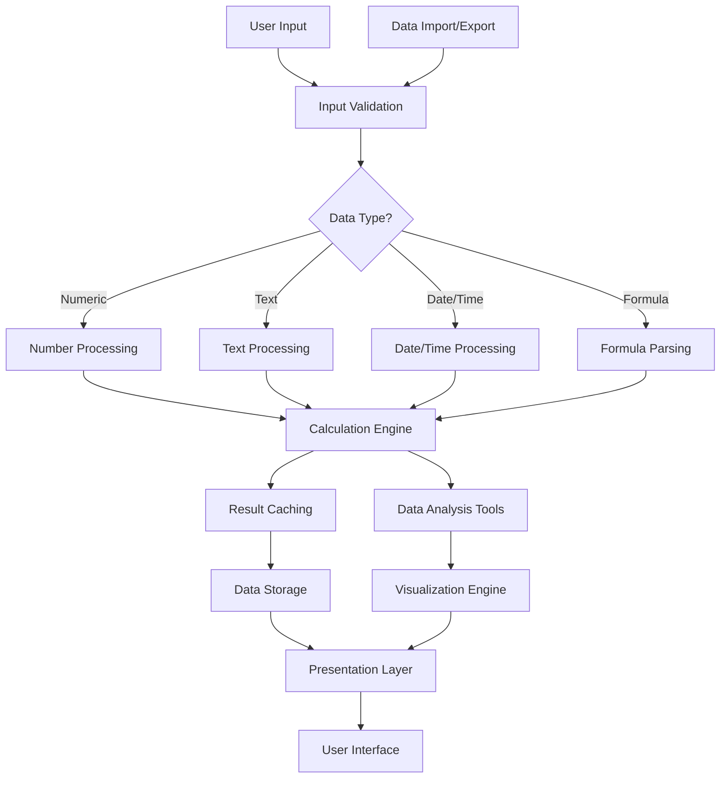

# INTRODUCTION

## PURPOSE

The purpose of this Software Requirements Specification (SRS) document is to provide a comprehensive and detailed description of the Microsoft Excel software application. This document serves as the primary reference for the development team, project managers, quality assurance testers, and other stakeholders involved in the creation and deployment of Microsoft Excel.

This SRS aims to:

1. Clearly define the functional and non-functional requirements of Microsoft Excel
2. Establish a shared understanding of the project scope and objectives among all stakeholders
3. Serve as a basis for project planning, cost estimation, and resource allocation
4. Provide a benchmark for validating the final product against the initial requirements
5. Act as a contractual agreement between the development team and Microsoft

The intended audience for this document includes:

- Software developers and engineers
- Project managers and team leads
- Quality assurance and testing teams
- User experience (UX) and user interface (UI) designers
- Microsoft executives and product managers
- Third-party integrators and API developers
- Technical writers and documentation specialists

## SCOPE

Microsoft Excel is a powerful and versatile spreadsheet application designed to revolutionize data management, analysis, and visualization for individuals and businesses across various industries. The software aims to provide an intuitive yet robust platform for organizing, manipulating, and deriving insights from complex datasets.

### Goals

1. Develop a user-friendly interface that caters to both novice and advanced users
2. Create a high-performance calculation engine capable of handling large datasets
3. Implement a comprehensive set of data analysis and visualization tools
4. Ensure seamless cross-platform functionality across desktop, web, and mobile devices
5. Integrate cloud-based features for enhanced collaboration and accessibility
6. Maintain compatibility with other Microsoft Office suite applications

### Benefits

1. Increased productivity through efficient data management and analysis
2. Enhanced decision-making capabilities with powerful visualization tools
3. Improved collaboration among team members with real-time co-authoring
4. Accessibility of data and functionality across multiple devices and platforms
5. Reduced learning curve for new users while providing advanced features for power users
6. Seamless integration with existing Microsoft Office workflows

### Core Functionalities

1. Grid-based interface for data input and manipulation
2. Support for various data types (numbers, text, dates, currencies)
3. Comprehensive formula system with 400+ built-in functions
4. Advanced charting and graphing capabilities
5. Pivot tables for data summarization and analysis
6. Data sorting, filtering, and validation tools
7. Macro recording and VBA support for automation
8. Real-time collaboration features
9. Cross-platform compatibility (Windows, macOS, web, iOS, and Android)
10. Cloud storage integration with OneDrive
11. Import/Export functionality for various file formats
12. Data protection and security features

Microsoft Excel will be developed using a combination of technologies to ensure optimal performance and cross-platform compatibility:

- C++ for core functionality and calculation engine
- C# for Windows desktop application
- Swift for macOS and iOS applications
- Kotlin for Android application
- HTML5, CSS3, and JavaScript frameworks for web application
- RESTful APIs for third-party integrations
- Azure cloud services for backend infrastructure

This SRS document will provide detailed specifications for each of these core functionalities, as well as non-functional requirements such as performance, security, and usability. It will serve as the guiding document throughout the development process, ensuring that the final product meets all specified requirements and delivers exceptional value to its users.

# PRODUCT DESCRIPTION

## PRODUCT PERSPECTIVE

Microsoft Excel is a cornerstone application within the larger Microsoft Office suite, designed to seamlessly integrate with other productivity tools such as Word, PowerPoint, and Outlook. As a standalone product, Excel serves as a comprehensive spreadsheet solution, but its true power is realized when utilized as part of the broader Microsoft ecosystem.

Excel operates within the following context:

1. Microsoft Office Suite: Excel shares common UI elements, file formats, and integration capabilities with other Office applications, allowing for smooth data exchange and consistent user experience.

2. Cloud Ecosystem: Leveraging Microsoft's Azure cloud infrastructure, Excel connects with OneDrive for cloud storage and synchronization, enabling real-time collaboration and access across devices.

3. Microsoft 365 Subscription Model: While available as a standalone product, Excel is often distributed as part of the Microsoft 365 subscription service, which provides regular updates and cloud-based features.

4. Cross-Platform Environment: Excel is designed to function across multiple platforms, including Windows, macOS, web browsers, and mobile devices (iOS and Android), with a consistent core feature set.

5. Third-Party Integration: Through its robust API, Excel can interact with a wide range of third-party applications and services, extending its functionality and data import/export capabilities.



## PRODUCT FUNCTIONS

Microsoft Excel provides a wide array of functions to support data management, analysis, and visualization. The main functions include:

1. Data Entry and Management
   - Grid-based interface for structured data input
   - Support for various data types (numbers, text, dates, currencies)
   - Data validation and error checking

2. Calculation and Formula Processing
   - Comprehensive formula system with 400+ built-in functions
   - Custom formula creation
   - Automatic recalculation and formula auditing tools

3. Data Analysis
   - Sorting and filtering capabilities
   - Pivot tables for data summarization and cross-tabulation
   - What-if analysis tools (Goal Seek, Scenario Manager, Data Tables)
   - Statistical analysis functions

4. Data Visualization
   - Charting and graphing tools with 20+ chart types
   - Conditional formatting for visual data representation
   - Sparklines for in-cell mini charts

5. Automation and Programmability
   - Macro recording for task automation
   - VBA support for custom functionality and complex automation

6. Collaboration and Sharing
   - Real-time co-authoring capabilities
   - Comments and review features
   - Sharing options with customizable permissions

7. Data Import and Export
   - Support for various file formats (CSV, XML, PDF)
   - Database connectivity and web data retrieval
   - API for programmatic data access

8. Security and Protection
   - Workbook and worksheet protection options
   - Data encryption for sensitive information
   - Multi-factor authentication support

9. Cross-Platform Accessibility
   - Consistent functionality across desktop, web, and mobile platforms
   - Cloud storage integration for file access from any device

10. Integration with Other Office Applications
    - Seamless data exchange with Word, PowerPoint, and other Office apps
    - Consistent UI and user experience across the Office suite

## USER CHARACTERISTICS

Microsoft Excel caters to a diverse user base with varying levels of expertise and requirements. The main user categories include:

1. Novice Users
   - Characteristics: Limited spreadsheet experience, occasional use for basic tasks
   - Needs: Intuitive interface, basic functionality, clear documentation and help resources
   - Example Persona: Sarah, a small business owner who uses Excel for simple budget tracking

2. Intermediate Users
   - Characteristics: Regular Excel users, familiar with common functions and features
   - Needs: Efficient data entry, commonly used formulas, basic charts and formatting
   - Example Persona: Mark, an office manager who creates monthly reports and manages departmental budgets

3. Advanced Users
   - Characteristics: Power users with deep Excel knowledge, often in professional roles
   - Needs: Complex formulas, advanced data analysis tools, automation capabilities
   - Example Persona: Emily, a financial analyst who uses Excel for complex financial modeling and data analysis

4. Data Analysts
   - Characteristics: Specialized in data manipulation and analysis, often with programming skills
   - Needs: Large dataset handling, advanced statistical functions, integration with other data tools
   - Example Persona: Alex, a data scientist who uses Excel in conjunction with other analytics tools for data preprocessing and visualization

5. Developers
   - Characteristics: Create custom solutions and integrations using Excel's programmability features
   - Needs: VBA environment, API access, integration with external systems
   - Example Persona: Michael, an IT consultant who develops custom Excel-based solutions for clients

6. Mobile Users
   - Characteristics: Require access to Excel functionality on-the-go
   - Needs: Core features on mobile devices, cloud synchronization, touch-friendly interface
   - Example Persona: Lisa, a sales manager who needs to update and view spreadsheets during client meetings

7. Collaborative Teams
   - Characteristics: Work together on shared documents, often in real-time
   - Needs: Co-authoring features, version control, commenting and review tools
   - Example Persona: The marketing team at a multinational corporation, collaborating on campaign budgets and performance metrics

## CONSTRAINTS

1. Technical Constraints
   - Must maintain backwards compatibility with earlier Excel file formats (.xls, .xlsx)
   - Performance limitations on mobile devices due to hardware constraints
   - Web version functionality limited by browser capabilities and security restrictions
   - Maximum worksheet size limited to 1,048,576 rows by 16,384 columns

2. Regulatory Constraints
   - Compliance with data protection regulations (e.g., GDPR, CCPA)
   - Adherence to accessibility standards (e.g., WCAG 2.1)
   - Export control regulations for encryption technology

3. Business Constraints
   - Must align with Microsoft's overall product strategy and branding
   - Pricing structure needs to fit within the Microsoft 365 subscription model
   - Feature parity expectations across different platforms (desktop, web, mobile)

4. User Interface Constraints
   - Consistency with Microsoft Office design language and UX patterns
   - Screen size limitations for mobile devices
   - Keyboard and mouse input on desktop vs. touch input on mobile devices

5. Integration Constraints
   - API limitations to protect system integrity and performance
   - Compatibility requirements with other Microsoft Office applications
   - Restrictions on third-party integrations to ensure security and stability

6. Performance Constraints
   - Response time for calculations should not exceed 2 seconds for standard operations
   - Memory usage should not exceed 4GB on 64-bit systems for optimal performance
   - Mobile app size should not exceed 100MB to facilitate easy downloads

7. Security Constraints
   - Implementation of Microsoft's security protocols and best practices
   - Encryption requirements for data at rest and in transit
   - Limitations on macro execution and external data connections to prevent security vulnerabilities

8. Localization Constraints
   - Support for right-to-left languages in user interface
   - Character limitations in certain languages affecting formula syntax
   - Date and currency format variations across different locales

## ASSUMPTIONS AND DEPENDENCIES

### Assumptions

1. Users have basic computer literacy and familiarity with spreadsheet concepts
2. The majority of users have reliable internet connectivity for cloud-based features
3. Microsoft's cloud infrastructure (Azure) will remain stable and scalable
4. The core Excel file format (.xlsx) will remain the industry standard for spreadsheets
5. Users are willing to adopt new features and UI changes with proper guidance
6. The demand for data analysis and visualization tools will continue to grow
7. Mobile device usage for productivity tasks will increase over time
8. Collaboration features will become increasingly important for users
9. VBA will remain a relevant programming language for Excel automation
10. Users will increasingly expect AI and machine learning capabilities in productivity tools

### Dependencies

1. Microsoft Office Suite: Excel's functionality is closely tied to integration with other Office applications
2. Azure Cloud Services: Cloud-based features and real-time collaboration depend on Azure infrastructure
3. Operating System Support: Relies on continued support and updates for Windows, macOS, iOS, and Android
4. Third-Party Libraries: Some advanced features may depend on external libraries or components
5. Web Technologies: The web version of Excel depends on evolving web standards and browser capabilities
6. Microsoft Account System: User authentication and licensing are tied to the Microsoft account ecosystem
7. App Stores: Distribution of mobile versions depends on Apple App Store and Google Play Store policies
8. .NET Framework: Core functionality may depend on .NET framework updates and support
9. Power BI: Advanced data analysis features may integrate with or depend on Power BI capabilities
10. Microsoft Graph API: Certain integration features may rely on the Microsoft Graph API for data access across Microsoft 365 services



This diagram illustrates the key dependencies of Microsoft Excel, showing how it relies on various Microsoft services, external platforms, and technologies to deliver its full range of functionality across different environments.

Here's the PROCESS FLOWCHART section for the Microsoft Excel Software Requirements Specification (SRS) using Mermaid JS:

# PROCESS FLOWCHART

The following flowchart illustrates the high-level process flow for the core functionality of Microsoft Excel:



This flowchart represents the primary user interactions within Microsoft Excel, including:

1. Starting Excel and choosing between creating a new workbook or opening an existing one.
2. Displaying the grid interface where users interact with the spreadsheet.
3. Various user actions such as inputting data, formatting cells, using formulas, creating charts, analyzing data, and collaborating with others.
4. The iterative process of performing multiple actions on the spreadsheet.
5. Saving or discarding changes before ending the Excel session.

The flowchart aligns with the core functionalities described in previous sections of the SRS, including data input, formula usage, charting capabilities, and collaboration features. It also reflects the cross-platform nature of Excel by representing a generic flow that applies to desktop, web, and mobile versions of the application.

This high-level process flow serves as a foundation for more detailed flowcharts that may be developed for specific features or modules within Microsoft Excel, such as the calculation engine, data import/export processes, or collaboration workflows.

Here's a breakdown of Microsoft Excel's features with the requested sub-sections:

1. Grid Interface

ID: F001
DESCRIPTION: The core spreadsheet interface with cells, rows, and columns for data input and manipulation.
PRIORITY: High

| Requirement ID | Requirement Description |
|----------------|--------------------------|
| F001-1 | Support for at least 1,048,576 rows by 16,384 columns |
| F001-2 | Cell merging and splitting capabilities |
| F001-3 | Freeze panes functionality for easier navigation |
| F001-4 | Auto-fill and drag-to-fill features for quick data entry |
| F001-5 | Multiple worksheet support within a single workbook |

2. Data Types and Formatting

ID: F002
DESCRIPTION: Support for various data types and cell formatting options.
PRIORITY: High

| Requirement ID | Requirement Description |
|----------------|--------------------------|
| F002-1 | Support for text, numbers, dates, times, and currencies |
| F002-2 | Custom number formatting options |
| F002-3 | Conditional formatting based on cell values or formulas |
| F002-4 | Cell styles and themes for consistent formatting |
| F002-5 | Format painter tool for copying formatting between cells |

3. Formula System

ID: F003
DESCRIPTION: Comprehensive formula capabilities for calculations and data analysis.
PRIORITY: High

| Requirement ID | Requirement Description |
|----------------|--------------------------|
| F003-1 | Support for 400+ built-in functions across various categories |
| F003-2 | Ability to create and use custom functions |
| F003-3 | Formula autocomplete and syntax checking |
| F003-4 | Array formulas for complex calculations |
| F003-5 | Formula auditing tools (trace precedents/dependents) |

4. Charts and Graphs

ID: F004
DESCRIPTION: Data visualization tools for creating various types of charts and graphs.
PRIORITY: High

| Requirement ID | Requirement Description |
|----------------|--------------------------|
| F004-1 | Support for 20+ chart types (e.g., bar, line, pie, scatter) |
| F004-2 | Customizable chart elements (titles, legends, axes) |
| F004-3 | Dynamic charts that update with data changes |
| F004-4 | Sparklines for in-cell mini charts |
| F004-5 | 3D chart options for select chart types |

5. Data Analysis Tools

ID: F005
DESCRIPTION: Advanced features for analyzing and summarizing data.
PRIORITY: Medium

| Requirement ID | Requirement Description |
|----------------|--------------------------|
| F005-1 | Pivot Tables for data summarization and cross-tabulation |
| F005-2 | Data sorting and filtering capabilities |
| F005-3 | What-if analysis tools (Goal Seek, Scenario Manager) |
| F005-4 | Data validation for controlling input |
| F005-5 | Subtotal and grouping functions |

6. Macros and VBA

ID: F006
DESCRIPTION: Automation and customization capabilities using macros and VBA.
PRIORITY: Medium

| Requirement ID | Requirement Description |
|----------------|--------------------------|
| F006-1 | Macro recorder for automating repetitive tasks |
| F006-2 | VBA editor for writing and editing code |
| F006-3 | Support for UserForms for custom dialogs |
| F006-4 | Ability to create custom functions using VBA |
| F006-5 | Option to run macros automatically on workbook open/close |

7. Collaboration Features

ID: F007
DESCRIPTION: Tools for sharing and collaborating on spreadsheets.
PRIORITY: High

| Requirement ID | Requirement Description |
|----------------|--------------------------|
| F007-1 | Real-time co-authoring for simultaneous editing |
| F007-2 | Comments and review features |
| F007-3 | Version history and restore capabilities |
| F007-4 | Sharing options with customizable permissions |
| F007-5 | Integration with Microsoft Teams for collaborative work |

8. Cross-Platform Compatibility

ID: F008
DESCRIPTION: Ensure Excel works consistently across different platforms and devices.
PRIORITY: High

| Requirement ID | Requirement Description |
|----------------|--------------------------|
| F008-1 | Windows desktop application using C# |
| F008-2 | macOS desktop application using Swift |
| F008-3 | Web application using HTML5, CSS3, and JavaScript |
| F008-4 | iOS mobile application using Swift |
| F008-5 | Android mobile application using Kotlin |

9. Cloud Integration

ID: F009
DESCRIPTION: Integration with cloud services for storage and synchronization.
PRIORITY: High

| Requirement ID | Requirement Description |
|----------------|--------------------------|
| F009-1 | OneDrive integration for cloud storage |
| F009-2 | Automatic saving and syncing across devices |
| F009-3 | Offline mode with synchronization upon reconnection |
| F009-4 | Integration with Azure Active Directory for authentication |
| F009-5 | Cloud-based Excel functions (e.g., STOCKHISTORY) |

10. Data Import/Export

ID: F010
DESCRIPTION: Capabilities to import and export data in various formats.
PRIORITY: Medium

| Requirement ID | Requirement Description |
|----------------|--------------------------|
| F010-1 | Import data from CSV, XML, and JSON files |
| F010-2 | Export to PDF, CSV, and XML formats |
| F010-3 | Power Query for advanced data import and transformation |
| F010-4 | Web scraping capabilities for importing online data |
| F010-5 | Database connectivity (e.g., SQL Server, MySQL) |

This feature breakdown maintains consistency with the previously mentioned technologies and frameworks, such as C# for Windows, Swift for macOS and iOS, Kotlin for Android, and web technologies for the browser-based version. The integration with Azure and OneDrive also aligns with the Microsoft ecosystem mentioned earlier in the document.

# NON-FUNCTIONAL REQUIREMENTS

## PERFORMANCE

1. Response Time
   - Excel shall open a 10MB workbook in less than 3 seconds on standard hardware.
   - Calculations involving up to 100,000 cells shall complete within 1 second.
   - Chart rendering shall occur within 2 seconds for datasets up to 50,000 points.

2. Throughput
   - The system shall support concurrent editing by up to 100 users on a single workbook.
   - Excel shall handle workbooks with up to 1 million rows and 16,384 columns.
   - The application shall support importing CSV files up to 1GB in size.

3. Resource Usage
   - Excel shall not consume more than 4GB of RAM for workbooks under 100MB.
   - CPU usage shall not exceed 70% during normal operations on standard hardware.
   - The desktop application installation size shall not exceed 2GB.

## SAFETY

1. Data Protection
   - Excel shall automatically save user data every 5 minutes to prevent data loss.
   - The application shall maintain a recoverable state in case of unexpected shutdowns.
   - A minimum of 5 previous versions of each workbook shall be retained for recovery purposes.

2. Error Handling
   - Excel shall gracefully handle and log all runtime errors without crashing.
   - Users shall be prompted to save their work before any potentially destructive operations.
   - The application shall provide clear error messages and suggested resolutions for common issues.

3. Backup and Recovery
   - Excel shall support automated cloud backup for all user data when connected to the internet.
   - The system shall provide a data recovery wizard to restore from local or cloud backups.
   - In case of file corruption, Excel shall attempt to recover as much data as possible from the damaged file.

## SECURITY

1. Authentication
   - Excel shall support multi-factor authentication for Microsoft account logins.
   - The application shall integrate with Azure Active Directory for enterprise user management.
   - Password policies shall enforce a minimum of 12 characters with complexity requirements.

2. Authorization
   - Excel shall implement role-based access control for shared workbooks.
   - The system shall support granular permissions for viewing, editing, and sharing at the worksheet level.
   - All API access shall require OAuth 2.0 authentication with proper scopes.

3. Data Encryption
   - All data in transit shall be encrypted using TLS 1.3 or higher.
   - Workbooks marked as sensitive shall be encrypted at rest using AES-256 encryption.
   - Excel shall support Windows BitLocker and macOS FileVault for full-disk encryption.

4. Privacy
   - User data shall be anonymized for any telemetry or crash reporting.
   - The application shall comply with GDPR and CCPA requirements for data protection and user privacy.
   - Excel shall provide options for users to control data sharing and personalization features.

## QUALITY

1. Availability
   - The Excel web application shall maintain 99.9% uptime, measured monthly.
   - Planned maintenance downtimes shall not exceed 4 hours per month and shall be scheduled during off-peak hours.
   - The system shall implement load balancing and failover mechanisms to ensure high availability.

2. Maintainability
   - The codebase shall adhere to Microsoft's coding standards and best practices.
   - All components shall have unit test coverage of at least 80%.
   - The system architecture shall be modular to allow for easy updates and feature additions.

3. Usability
   - Excel shall maintain a consistent user interface across all platforms (Windows, macOS, web, iOS, and Android).
   - The application shall support keyboard shortcuts for all major functions.
   - Excel shall provide context-sensitive help and tooltips for complex features.
   - The user interface shall be localized in at least 25 languages.

4. Scalability
   - The web application architecture shall support horizontal scaling to handle increased user load.
   - Database systems shall be designed to scale vertically for larger datasets.
   - The API shall implement rate limiting and caching to manage high-volume requests.

5. Reliability
   - Excel shall have a Mean Time Between Failures (MTBF) of at least 720 hours.
   - The system shall have a Recovery Time Objective (RTO) of less than 15 minutes.
   - Automated regression testing shall be performed before each release to ensure stability.

## COMPLIANCE

1. Legal Compliance
   - Excel shall comply with all applicable copyright laws regarding font usage and distribution.
   - The application shall adhere to software patent regulations in all markets where it is distributed.
   - Licensing terms shall be clearly communicated to users during installation and activation.

2. Regulatory Compliance
   - Excel shall meet the requirements of the Sarbanes-Oxley Act for financial data handling and reporting.
   - The application shall comply with HIPAA regulations when handling healthcare-related data.
   - Data retention and deletion policies shall align with GDPR and CCPA requirements.

3. Standards Compliance
   - Excel shall conform to the ISO/IEC 29500 standard for Office Open XML file formats.
   - The web application shall meet WCAG 2.1 Level AA standards for accessibility.
   - All cryptographic implementations shall comply with FIPS 140-2 standards.
   - The software development process shall adhere to ISO/IEC 12207 for software lifecycle processes.

4. Industry-Specific Compliance
   - Excel shall support FDA 21 CFR Part 11 compliance for electronic records in regulated industries.
   - The application shall provide features to assist in SOC 2 compliance for service organizations.
   - Excel shall include templates and functions to support IFRS and GAAP financial reporting standards.

These non-functional requirements align with the previously mentioned technologies and frameworks, including C# for Windows development, Swift for macOS and iOS, Kotlin for Android, and web technologies for the browser-based version. The integration with Azure Active Directory and compliance with various standards ensures that Excel meets the high expectations for a professional, enterprise-grade application while maintaining consistency across platforms.

# DATA REQUIREMENTS

## DATA MODELS

Microsoft Excel's data model is designed to efficiently represent and manage spreadsheet data across various platforms. The core entities and their relationships are illustrated in the following entity-relationship diagram:

```mermaid
erDiagram
    WORKBOOK ||--|{ WORKSHEET : contains
    WORKSHEET ||--|{ CELL : contains
    CELL ||--o| FORMULA : may-have
    CELL ||--o| STYLE : may-have
    WORKSHEET ||--o{ CHART : may-have
    WORKSHEET ||--o{ PIVOT_TABLE : may-have
    WORKBOOK ||--o{ NAMED_RANGE : may-have
    WORKBOOK ||--o{ MACRO : may-have
    USER ||--|{ WORKBOOK : owns
    USER ||--o{ SHARED_WORKBOOK : collaborates-on

    WORKBOOK {
        string id PK
        string name
        datetime created_at
        datetime modified_at
        string owner_id FK
    }
    WORKSHEET {
        string id PK
        string name
        int index
        string workbook_id FK
    }
    CELL {
        string id PK
        string worksheet_id FK
        int row
        int column
        string value
        string data_type
    }
    FORMULA {
        string id PK
        string cell_id FK
        string expression
    }
    STYLE {
        string id PK
        string cell_id FK
        string font
        string color
        string background
        string border
    }
    CHART {
        string id PK
        string worksheet_id FK
        string type
        string data_range
    }
    PIVOT_TABLE {
        string id PK
        string worksheet_id FK
        string source_data
        string rows
        string columns
        string values
    }
    NAMED_RANGE {
        string id PK
        string workbook_id FK
        string name
        string range
    }
    MACRO {
        string id PK
        string workbook_id FK
        string name
        string code
    }
    USER {
        string id PK
        string username
        string email
    }
    SHARED_WORKBOOK {
        string user_id FK
        string workbook_id FK
        string permission_level
    }
```

This data model supports the core functionality of Microsoft Excel, including multi-sheet workbooks, cell-based data storage, formulas, styling, charts, pivot tables, named ranges, and macros. It also incorporates user ownership and collaboration features.

## DATA STORAGE

Microsoft Excel's data storage strategy is designed to ensure data integrity, availability, and scalability across its various platforms (desktop, web, and mobile).

1. Local Storage (Desktop Applications)
   - File Format: Use the Open XML-based .xlsx format for default file storage
   - Temporary Files: Implement auto-save functionality using temporary files to prevent data loss
   - File Compression: Utilize ZIP compression to reduce file size and improve I/O performance

2. Cloud Storage (Web and Mobile Applications)
   - Database: Use Azure Cosmos DB for its global distribution and multi-model capabilities
   - Blob Storage: Leverage Azure Blob Storage for large binary objects (e.g., embedded images, charts)
   - Caching: Implement Azure Redis Cache for improved performance on frequently accessed data

3. Data Retention
   - Version History: Maintain up to 100 versions of each workbook for 60 days
   - Deleted Items: Retain deleted workbooks in a recoverable state for 30 days
   - Long-term Archival: Offer optional long-term archival using Azure Cool Blob Storage

4. Data Redundancy
   - Geo-Replication: Implement Azure Cosmos DB's multi-region writes for high availability
   - Read Replicas: Use read replicas in high-traffic regions to reduce latency and improve performance

5. Backup and Recovery
   - Automated Backups: Perform daily automated backups of all databases and blob storage
   - Point-in-Time Recovery: Enable point-in-time recovery for the last 35 days
   - Disaster Recovery: Implement Azure Site Recovery for cross-region disaster recovery

6. Scalability
   - Horizontal Scaling: Utilize Azure Cosmos DB's partitioning capabilities for horizontal scaling
   - Auto-scaling: Implement auto-scaling for web and API tiers to handle varying loads
   - Content Delivery Network: Use Azure CDN to cache static assets and improve global performance

## DATA PROCESSING

Microsoft Excel's data processing pipeline is designed to handle large volumes of data efficiently while ensuring security and compliance. The following data flow diagram illustrates the high-level data processing architecture:



Data Security Measures:

1. Encryption
   - Data at Rest: Implement Azure Storage Service Encryption with Microsoft-managed keys
   - Data in Transit: Use TLS 1.3 for all network communications
   - Cell-Level Encryption: Offer optional cell-level encryption for sensitive data

2. Access Control
   - Role-Based Access Control (RBAC): Implement fine-grained RBAC for workbook and worksheet access
   - Multi-Factor Authentication: Enforce MFA for accessing sensitive workbooks
   - Conditional Access: Use Azure AD Conditional Access policies to restrict access based on user location, device state, and risk level

3. Data Loss Prevention (DLP)
   - Content Scanning: Implement real-time content scanning to detect and protect sensitive information
   - Policy Enforcement: Apply DLP policies to prevent unauthorized sharing of sensitive data
   - Audit Logging: Maintain comprehensive audit logs for all data access and modifications

4. Compliance
   - GDPR Compliance: Implement features for data subject access requests and right to be forgotten
   - HIPAA Compliance: Ensure data handling processes meet HIPAA requirements for healthcare-related data
   - SOC 2 Compliance: Maintain SOC 2 compliance for data security and availability

5. Secure Development Practices
   - Input Validation: Implement strict input validation to prevent injection attacks
   - Least Privilege Principle: Apply least privilege access to all system components
   - Regular Security Audits: Conduct regular security audits and penetration testing

6. Data Isolation
   - Multi-Tenancy: Implement logical data isolation in multi-tenant environments
   - Sandboxing: Use sandboxing techniques for running user-defined functions and macros

7. Monitoring and Threat Detection
   - Real-time Monitoring: Implement Azure Security Center for real-time security monitoring
   - Threat Intelligence: Utilize Azure Sentinel for advanced threat detection and response
   - Anomaly Detection: Implement machine learning-based anomaly detection for unusual data access patterns

By implementing these data processing and security measures, Microsoft Excel ensures efficient, secure, and compliant handling of user data across all supported platforms.

# EXTERNAL INTERFACES

## USER INTERFACES

Microsoft Excel will provide a consistent and intuitive user interface across all supported platforms, including desktop (Windows and macOS), web, and mobile (iOS and Android) versions. The interface will be designed to accommodate both novice and advanced users, with a focus on accessibility and ease of use.

Key UI components include:

1. Ribbon-style toolbar
   - Organized into logical tabs (e.g., Home, Insert, Page Layout, Formulas, Data, Review)
   - Contextual tabs that appear based on selected content or active features

2. Quick Access Toolbar
   - Customizable for frequently used commands

3. Formula Bar
   - Displays and allows editing of cell contents and formulas

4. Worksheet Grid
   - Resizable columns and rows
   - Freeze panes functionality
   - Cell merging and splitting options

5. Sheet Tabs
   - Easy navigation between multiple worksheets

6. Status Bar
   - Displays relevant information and quick calculations

7. Charting Interface
   - Interactive chart creation and editing tools

8. Pivot Table Builder
   - Drag-and-drop interface for creating and modifying pivot tables

9. Sidebar Panels
   - Context-sensitive panels for advanced features (e.g., formatting, data analysis)

10. Mobile-Optimized Interface
    - Touch-friendly controls and gestures
    - Simplified toolbar for common actions

[Placeholder for UI mockups]

Accessibility features will include:

- High-contrast mode
- Screen reader compatibility
- Keyboard navigation support
- Customizable font sizes and color schemes

The UI will be implemented using the following technologies:

- Windows: WPF (Windows Presentation Foundation) with XAML
- macOS: AppKit and SwiftUI
- Web: HTML5, CSS3, and React.js
- iOS: UIKit and SwiftUI
- Android: Jetpack Compose

## HARDWARE INTERFACES

While Microsoft Excel is primarily a software application, it will interface with various hardware components to enhance functionality and user experience:

1. Input Devices
   - Keyboard and Mouse: Standard input for desktop versions
   - Touchscreen: Support for touch-based input on compatible devices
   - Stylus: Enhanced precision for touch input, particularly on tablets

2. Display Devices
   - Support for multiple monitors with extended desktop functionality
   - Adaptive layout for various screen sizes and resolutions
   - High DPI support for crisp rendering on high-resolution displays

3. Printing Devices
   - Interface with local and network printers
   - Support for various paper sizes and orientations
   - Print preview functionality

4. Storage Devices
   - Access to local hard drives, SSDs, and removable storage (e.g., USB drives)
   - Automatic detection of available storage devices

5. Network Hardware
   - Utilize available network interfaces (Ethernet, Wi-Fi) for cloud synchronization and collaboration features

6. Cameras
   - Integration with device cameras for scanning documents or QR codes (mobile versions)

7. Biometric Sensors
   - Support for fingerprint and facial recognition for secure login (on compatible devices)

Hardware interfaces will be implemented using standard APIs provided by each operating system:

- Windows: Win32 API and Windows Driver Model (WDM)
- macOS and iOS: IOKit framework
- Android: Hardware Abstraction Layer (HAL)

## SOFTWARE INTERFACES

Microsoft Excel will interact with various software systems and components to provide a comprehensive and integrated user experience:

1. Operating Systems
   - Windows 10 and later
   - macOS 10.15 (Catalina) and later
   - iOS 14 and later
   - Android 9 (Pie) and later

2. Microsoft Office Suite
   - Seamless data exchange with Word, PowerPoint, and other Office applications
   - Consistent styling and formatting across the suite

3. Cloud Storage Services
   - Primary integration with OneDrive for cloud storage and synchronization
   - Support for SharePoint document libraries

4. Database Management Systems
   - Direct connection to Microsoft SQL Server, MySQL, and PostgreSQL
   - ODBC support for other database systems

5. Web Services
   - RESTful API for third-party integrations
   - OAuth 2.0 for secure authentication with external services

6. Version Control Systems
   - Integration with Git for version control of Excel files (primarily for developer use)

7. Collaboration Platforms
   - Integration with Microsoft Teams for enhanced collaboration features

8. Add-in Ecosystem
   - Support for Excel add-ins developed using the Office Add-in platform

9. Data Analysis Tools
   - Integration with Power BI for advanced data visualization
   - R and Python integration for statistical analysis (in advanced versions)

10. Web Browsers (for web version)
    - Support for latest versions of Chrome, Firefox, Safari, and Edge

Software interfaces will be implemented using:

- COM and .NET interfaces for Windows integrations
- Apple Event and XPC for macOS integrations
- RESTful APIs for web service integrations
- Office Add-in API for extensibility
- WebAssembly for web browser optimizations

## COMMUNICATION INTERFACES

Microsoft Excel will utilize various communication interfaces to enable data exchange, collaboration, and integration with external systems:

1. Network Protocols
   - HTTP/HTTPS for web-based communications
   - WebSocket for real-time collaboration features
   - FTP/SFTP for legacy file transfer support

2. Data Formats
   - JSON and XML for data interchange
   - CSV for simple data import/export
   - XLSX as the primary file format
   - Support for legacy XLS format

3. API Interfaces
   - RESTful API for third-party integrations
   - GraphQL API for efficient data querying (future implementation)

4. Synchronization Protocols
   - Microsoft Sync Framework for data synchronization across devices
   - Delta sync to minimize data transfer for large files

5. Email Protocols
   - SMTP for sending emails directly from Excel
   - IMAP/POP3 for receiving data via email (in advanced scenarios)

6. Remote Procedure Calls
   - gRPC for high-performance, cross-platform communication (internal use)

7. Collaboration Protocols
   - Operational Transformation (OT) for real-time co-authoring
   - WebRTC for peer-to-peer data exchange in collaborative sessions

8. Authentication Protocols
   - OAuth 2.0 for secure API authentication
   - SAML for enterprise single sign-on scenarios

9. Encryption Protocols
   - TLS 1.3 for secure data transmission
   - AES-256 for file-level encryption

10. Notification Services
    - WebSockets for real-time notifications
    - Push notifications for mobile devices (APNS for iOS, FCM for Android)

Implementation details:

- Use of .NET HttpClient for HTTP communications in Windows version
- NSURLSession for networking in macOS and iOS versions
- OkHttp library for Android networking
- Socket.IO for real-time communications in web version
- Azure Service Bus for message queuing and event-driven architectures
- Implementation of Circuit Breaker and Retry patterns for resilient communication

These communication interfaces will ensure that Microsoft Excel can securely and efficiently exchange data with various external systems, facilitate real-time collaboration, and provide a seamless experience across different platforms and devices.

# APPENDICES

## GLOSSARY

- **Cell**: The basic unit of a spreadsheet, where data is entered and stored.
- **Formula**: An expression that calculates values based on the contents of other cells.
- **Workbook**: A file that contains one or more worksheets.
- **Worksheet**: A single spreadsheet within a workbook.
- **Pivot Table**: A data summarization tool that can automatically sort, count, total, or average data stored in a table.
- **Macro**: A recorded sequence of actions or a custom function written in VBA.
- **Ribbon**: The tabbed toolbar interface used in Microsoft Office applications.
- **Sparkline**: A small chart contained within a single cell.
- **Named Range**: A defined area of cells with a custom name for easy reference in formulas.
- **Conditional Formatting**: A feature that changes the appearance of cells based on their contents.

## ACRONYMS

- **API**: Application Programming Interface
- **CSV**: Comma-Separated Values
- **DLP**: Data Loss Prevention
- **GDPR**: General Data Protection Regulation
- **GUI**: Graphical User Interface
- **HIPAA**: Health Insurance Portability and Accountability Act
- **JSON**: JavaScript Object Notation
- **ODBC**: Open Database Connectivity
- **RBAC**: Role-Based Access Control
- **SaaS**: Software as a Service
- **SDK**: Software Development Kit
- **SQL**: Structured Query Language
- **TLS**: Transport Layer Security
- **UI**: User Interface
- **UX**: User Experience
- **VBA**: Visual Basic for Applications
- **WCAG**: Web Content Accessibility Guidelines
- **XML**: Extensible Markup Language

## ADDITIONAL REFERENCES

1. Microsoft Office Open XML File Formats Standard: 
   https://docs.microsoft.com/en-us/openspecs/office_standards/ms-xlsx/

2. Excel JavaScript API Reference:
   https://docs.microsoft.com/en-us/javascript/api/excel

3. Microsoft Graph API Documentation:
   https://docs.microsoft.com/en-us/graph/

4. Azure Active Directory Documentation:
   https://docs.microsoft.com/en-us/azure/active-directory/

5. Web Accessibility Initiative (WAI) Guidelines:
   https://www.w3.org/WAI/standards-guidelines/

6. OAuth 2.0 Authorization Framework:
   https://oauth.net/2/

7. Microsoft Power Query Documentation:
   https://docs.microsoft.com/en-us/power-query/

8. VBA Language Reference:
   https://docs.microsoft.com/en-us/office/vba/api/overview/excel

9. Microsoft Excel Functions (by category):
   https://support.microsoft.com/en-us/office/excel-functions-by-category-5f91f4e9-7b42-46d2-9bd1-63f26a86c0eb

10. Azure Cosmos DB Documentation:
    https://docs.microsoft.com/en-us/azure/cosmos-db/

These additional references provide in-depth information on various technologies and standards used in the development of Microsoft Excel, as mentioned throughout the SRS document. They serve as valuable resources for developers, testers, and other stakeholders involved in the project.