# INTRODUCTION

## SYSTEM OVERVIEW

Microsoft Excel is a comprehensive spreadsheet application designed to provide powerful data management, analysis, and visualization capabilities across multiple platforms. The system is built to cater to a wide range of users, from novices to advanced data analysts, offering an intuitive interface coupled with robust functionality.

### Key Components

1. **Core Calculation Engine**: Written in C++ for optimal performance, handling complex calculations and large datasets efficiently.

2. **User Interface Layer**: 
   - Windows: Developed using C# and WPF
   - macOS: Built with Swift and AppKit/SwiftUI
   - Web: Utilizing HTML5, CSS3, and React.js
   - iOS: Implemented with Swift and UIKit/SwiftUI
   - Android: Developed using Kotlin and Jetpack Compose

3. **Data Storage and Synchronization**: Leveraging Azure Cosmos DB for cloud storage and Azure Blob Storage for large binary objects.

4. **Collaboration Services**: Real-time co-authoring and sharing capabilities built on Azure infrastructure.

5. **Add-in Framework**: Supporting extensibility through the Office Add-in platform.

6. **API Layer**: RESTful APIs for third-party integrations and inter-application communication.

### High-Level Architecture

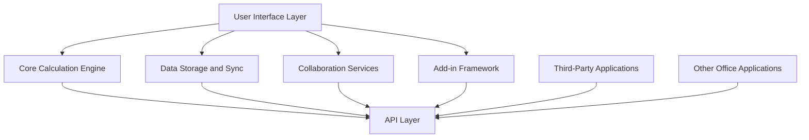

### Key Features

1. Grid-based interface for data input and manipulation
2. Comprehensive formula system with 400+ built-in functions
3. Advanced charting and data visualization tools
4. Pivot tables and data analysis features
5. Macro recording and VBA support for automation
6. Real-time collaboration and sharing capabilities
7. Cross-platform compatibility (Windows, macOS, Web, iOS, Android)
8. Cloud integration for storage and synchronization
9. Data import/export in various formats
10. Extensibility through add-ins and APIs

### Integration Points

| Integration Point | Description | Technology |
|-------------------|-------------|------------|
| Microsoft Office Suite | Seamless data exchange with Word, PowerPoint, etc. | COM, Office JavaScript API |
| Cloud Storage | Primary integration with OneDrive | Microsoft Graph API |
| Databases | Direct connection to various DBMS | ODBC, ADO.NET |
| External Services | Integration with third-party tools and services | RESTful API, OAuth 2.0 |
| Collaboration Platforms | Integration with Microsoft Teams | Microsoft Graph API |

This system overview provides a high-level perspective of Microsoft Excel's architecture, key components, features, and integration points. The design ensures scalability, cross-platform compatibility, and extensibility while maintaining high performance and user-friendly interfaces across all supported platforms.

# SYSTEM ARCHITECTURE

## PROGRAMMING LANGUAGES

The following programming languages will be used in the development of Microsoft Excel, chosen for their specific strengths and suitability for different components of the system:

| Language | Purpose | Justification |
|----------|---------|---------------|
| C++ | Core calculation engine | High performance, low-level memory management, and compatibility with existing codebase |
| C# | Windows desktop application | Strong integration with Windows ecosystem, robust .NET framework support |
| Swift | macOS and iOS applications | Native performance on Apple platforms, modern language features |
| Kotlin | Android application | Official language for Android development, interoperability with Java |
| TypeScript | Web application frontend | Static typing for large-scale JavaScript applications, improved maintainability |
| Python | Data analysis and scripting | Rich ecosystem for data science, ease of use for extensibility |
| SQL | Database queries and management | Standard language for relational database operations |
| VBA | Macro programming and automation | Backward compatibility with existing Excel macros |

## HIGH-LEVEL ARCHITECTURE DIAGRAM

The following diagram provides an overview of Microsoft Excel's high-level architecture:

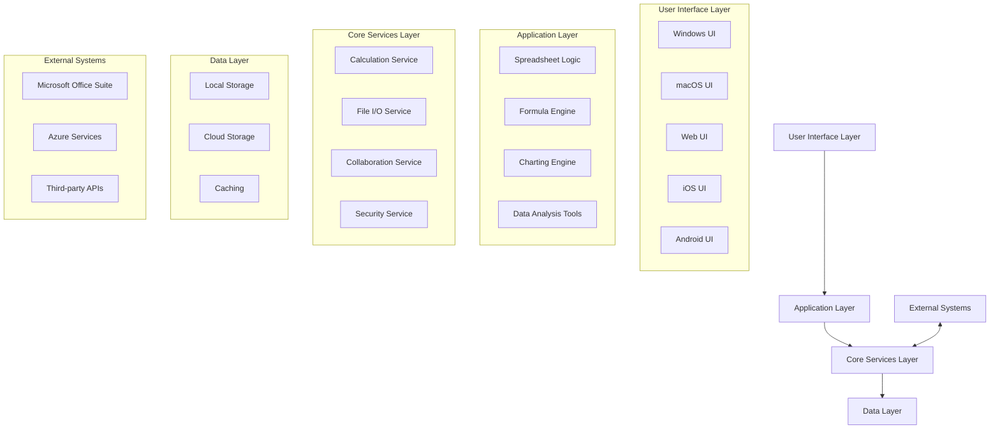

## COMPONENT DIAGRAMS

### Spreadsheet Engine Component

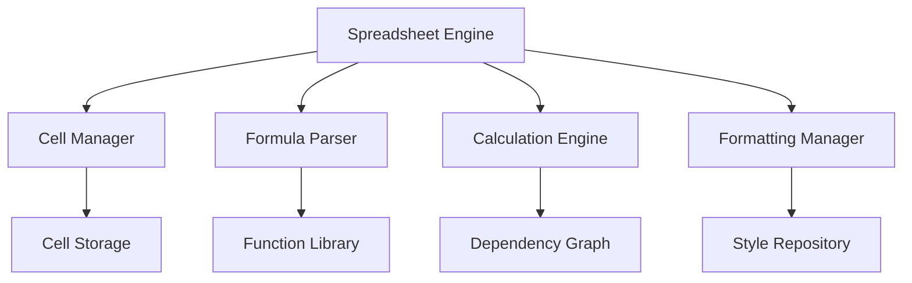

### Collaboration Component

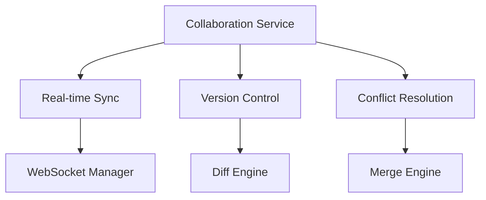

## SEQUENCE DIAGRAMS

### Formula Calculation Sequence

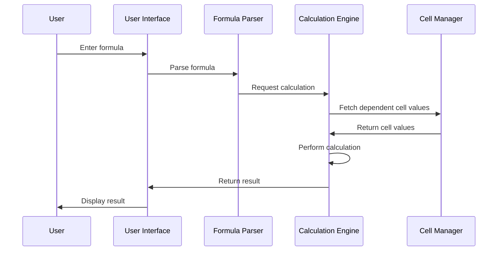

### Real-time Collaboration Sequence

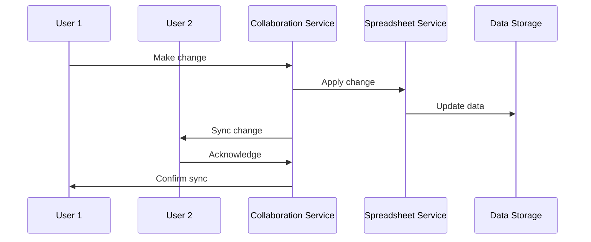

## DATA-FLOW DIAGRAM

The following diagram illustrates how data flows through the Microsoft Excel system:

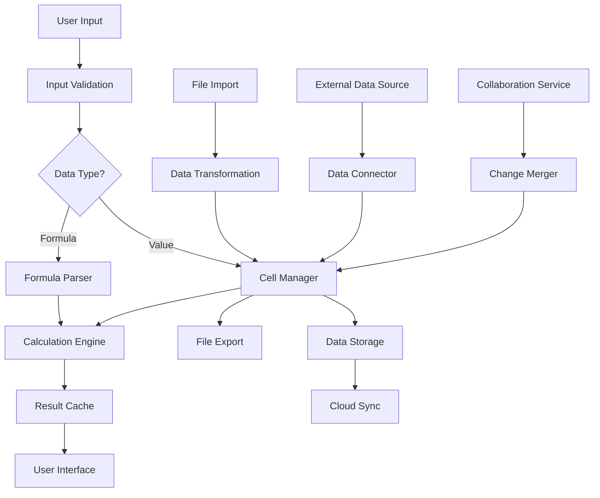

This data flow diagram shows how information moves through the Excel system, from user input and file imports to calculation, storage, and export. It also illustrates the interaction with external data sources and the collaboration service, highlighting the complex data management capabilities of the application.

# SYSTEM DESIGN

## PROGRAMMING LANGUAGES

The following programming languages will be used in the development of Microsoft Excel, chosen for their specific strengths and suitability for different components of the system:

| Language | Purpose | Justification |
|----------|---------|---------------|
| C++ | Core calculation engine | High performance, low-level memory management, and compatibility with existing codebase |
| C# | Windows desktop application | Strong integration with Windows ecosystem, robust .NET framework support |
| Swift | macOS and iOS applications | Native performance on Apple platforms, modern language features |
| Kotlin | Android application | Official language for Android development, interoperability with Java |
| TypeScript | Web application frontend | Static typing for large-scale JavaScript applications, improved maintainability |
| Python | Data analysis and scripting | Rich ecosystem for data science, ease of use for extensibility |
| SQL | Database queries and management | Standard language for relational database operations |
| VBA | Macro programming and automation | Backward compatibility with existing Excel macros |

## DATABASE DESIGN

Microsoft Excel will utilize a hybrid database approach, combining relational and NoSQL databases to accommodate various data storage needs:

1. Azure Cosmos DB (NoSQL)
   - Purpose: Store workbook metadata, user preferences, and collaboration data
   - Justification: Globally distributed, multi-model database for scalability and flexibility

2. Azure SQL Database (Relational)
   - Purpose: Store structured data for reporting, user management, and licensing
   - Justification: ACID compliance, complex query support, and integration with existing systems

3. Azure Blob Storage
   - Purpose: Store large binary objects (e.g., embedded images, attachments)
   - Justification: Cost-effective storage for unstructured data

Key Database Schema (Azure SQL Database):

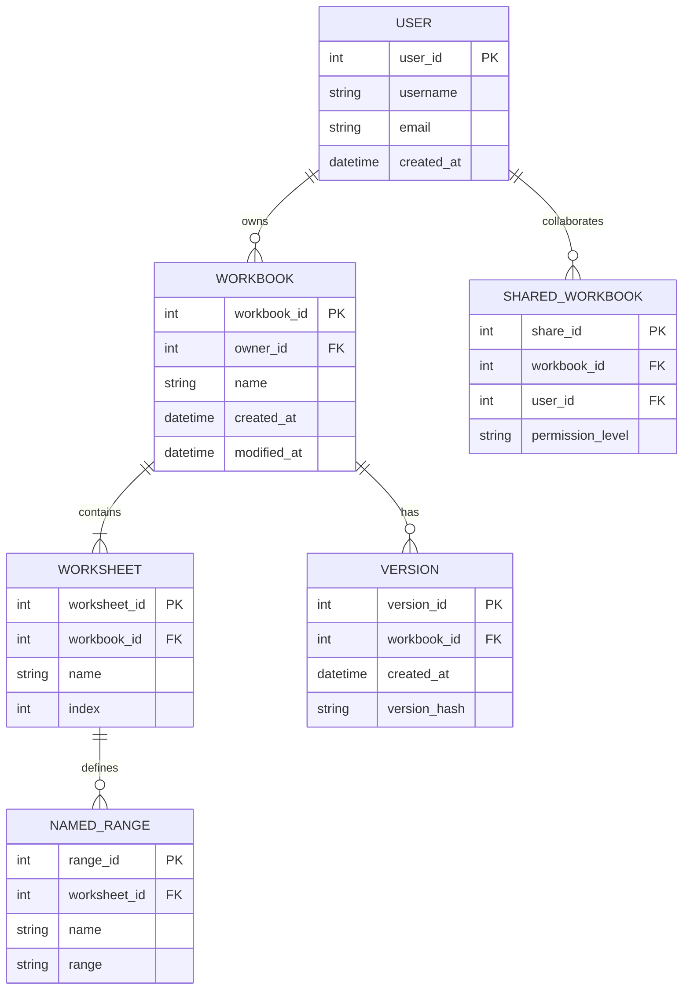

## API DESIGN

Microsoft Excel will expose a RESTful API for integration with external systems and to support the web and mobile applications. The API will follow OpenAPI (Swagger) specifications for documentation and consistency.

Key API Endpoints:

1. Workbook Management
   - `GET /api/workbooks`: List user's workbooks
   - `POST /api/workbooks`: Create a new workbook
   - `GET /api/workbooks/{id}`: Retrieve a specific workbook
   - `PUT /api/workbooks/{id}`: Update a workbook
   - `DELETE /api/workbooks/{id}`: Delete a workbook

2. Worksheet Operations
   - `GET /api/workbooks/{id}/worksheets`: List worksheets in a workbook
   - `POST /api/workbooks/{id}/worksheets`: Add a new worksheet
   - `PUT /api/workbooks/{id}/worksheets/{sheet_id}`: Update a worksheet

3. Cell Operations
   - `GET /api/workbooks/{id}/worksheets/{sheet_id}/cells/{range}`: Get cell values
   - `PUT /api/workbooks/{id}/worksheets/{sheet_id}/cells/{range}`: Update cell values

4. Collaboration
   - `POST /api/workbooks/{id}/share`: Share a workbook
   - `GET /api/workbooks/{id}/collaborators`: List collaborators
   - `DELETE /api/workbooks/{id}/collaborators/{user_id}`: Remove a collaborator

5. Formulas and Functions
   - `POST /api/calculate`: Evaluate a formula or function

Authentication will be handled using OAuth 2.0 with Azure Active Directory integration.

## USER INTERFACE DESIGN

The user interface for Microsoft Excel will be designed to provide a consistent experience across platforms while optimizing for each platform's unique characteristics.

Common UI Elements:

1. Ribbon Interface
   - Tabs: Home, Insert, Page Layout, Formulas, Data, Review, View
   - Contextual tabs for specific content (e.g., Chart Tools, Table Tools)

2. Quick Access Toolbar
   - Customizable for frequently used commands

3. Formula Bar
   - Input and editing of cell contents and formulas

4. Worksheet Grid
   - Resizable columns and rows
   - Freeze panes functionality

5. Sheet Tabs
   - Navigation between worksheets

6. Status Bar
   - Quick calculations and view options

Platform-Specific Considerations:

1. Windows (WPF)
   - Full desktop functionality
   - Support for multiple windows and advanced docking

2. macOS (AppKit/SwiftUI)
   - Native macOS look and feel
   - Touch Bar support for recent MacBook Pro models

3. Web (React.js)
   - Responsive design for various screen sizes
   - Progressive Web App (PWA) capabilities for offline use

4. iOS (UIKit/SwiftUI)
   - Touch-optimized interface
   - Support for Apple Pencil on compatible devices

5. Android (Jetpack Compose)
   - Material Design principles
   - Adaptive layouts for various device form factors

Mockup of the Main Interface (Web Version):

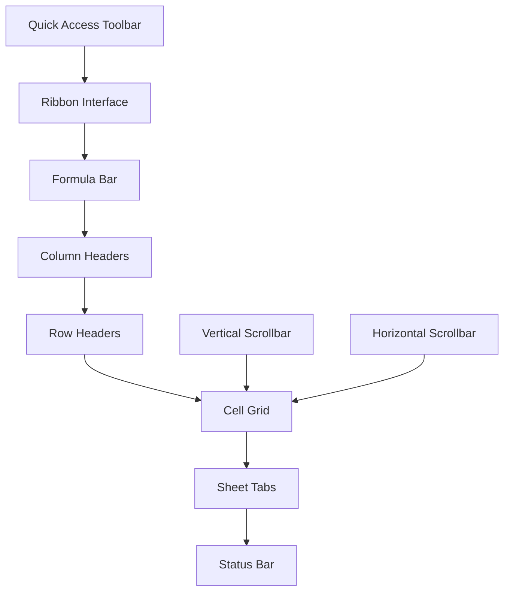

The user interface will be designed with accessibility in mind, adhering to WCAG 2.1 guidelines and providing features such as high-contrast modes, keyboard navigation, and screen reader compatibility across all platforms.

# TECHNOLOGY STACK

## PROGRAMMING LANGUAGES

The following programming languages will be used in the development of Microsoft Excel, chosen for their specific strengths and suitability for different components of the system:

| Language | Purpose | Justification |
|----------|---------|---------------|
| C++ | Core calculation engine | High performance, low-level memory management, and compatibility with existing codebase |
| C# | Windows desktop application | Strong integration with Windows ecosystem, robust .NET framework support |
| Swift | macOS and iOS applications | Native performance on Apple platforms, modern language features |
| Kotlin | Android application | Official language for Android development, interoperability with Java |
| TypeScript | Web application frontend | Static typing for large-scale JavaScript applications, improved maintainability |
| Python | Data analysis and scripting | Rich ecosystem for data science, ease of use for extensibility |
| SQL | Database queries and management | Standard language for relational database operations |
| VBA | Macro programming and automation | Backward compatibility with existing Excel macros |

## FRAMEWORKS AND LIBRARIES

The following frameworks and libraries will be utilized to accelerate development and provide robust functionality:

| Framework/Library | Purpose | Platform |
|-------------------|---------|----------|
| .NET 6 | Core framework for Windows development | Windows |
| WPF | UI framework for Windows desktop | Windows |
| SwiftUI | UI framework for Apple platforms | macOS, iOS |
| Jetpack Compose | UI framework for Android | Android |
| React | Web application frontend | Web |
| Redux | State management for web application | Web |
| NumPy | Numerical computing for data analysis | Python integration |
| Pandas | Data manipulation and analysis | Python integration |
| Chart.js | Charting library for web version | Web |
| SignalR | Real-time communications | All platforms |

## DATABASES

Microsoft Excel will employ a combination of database technologies to meet various data storage and processing requirements:

| Database | Purpose | Justification |
|----------|---------|---------------|
| Azure Cosmos DB | Primary cloud database for workbook metadata and user data | Global distribution, multi-model support, scalability |
| Azure SQL Database | Relational data storage for structured data and reporting | ACID compliance, complex query support |
| Azure Blob Storage | Large binary object storage (e.g., embedded images) | Cost-effective storage for unstructured data |
| SQLite | Local database for offline functionality | Lightweight, serverless, suitable for mobile and desktop |
| Redis Cache | In-memory data structure store for caching | High performance, support for complex data structures |

## THIRD-PARTY SERVICES

The following external services and APIs will be integrated into Microsoft Excel to enhance functionality and user experience:

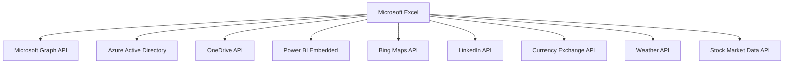

1. Microsoft Graph API: For integration with other Microsoft 365 services
2. Azure Active Directory: For user authentication and authorization
3. OneDrive API: For cloud storage and file synchronization
4. Power BI Embedded: For advanced data visualization capabilities
5. Bing Maps API: For geographical data visualization
6. LinkedIn API: For importing professional data and sharing capabilities
7. Currency Exchange API: For real-time currency conversion in financial functions
8. Weather API: For retrieving weather data in specific Excel functions
9. Stock Market Data API: For real-time stock quotes and historical data

These third-party services will be integrated using secure authentication methods (OAuth 2.0) and will adhere to Microsoft's data privacy and security standards.

This technology stack aligns with the previously mentioned technologies and frameworks, ensuring consistency across the Microsoft Excel ecosystem while leveraging the strengths of each platform and technology.

# SECURITY CONSIDERATIONS

## AUTHENTICATION AND AUTHORIZATION

Microsoft Excel will implement a robust authentication and authorization system to ensure secure access and appropriate permissions for users across all platforms.

### Authentication Methods

1. Microsoft Account Integration
   - Primary authentication method for consumer users
   - Support for multi-factor authentication (MFA)

2. Azure Active Directory (Azure AD) Integration
   - Enterprise-grade authentication for organizational users
   - Support for single sign-on (SSO) across Microsoft 365 applications

3. Third-party OAuth 2.0 Providers
   - Support for Google, Apple, and other popular identity providers
   - Implemented using OpenID Connect protocol

### Authorization Model

Excel will use a Role-Based Access Control (RBAC) system with the following roles:

| Role | Description | Permissions |
|------|-------------|-------------|
| Viewer | Can only view workbooks | Read-only access |
| Editor | Can edit workbooks | Read and write access |
| Reviewer | Can add comments and suggestions | Read access, comment creation |
| Owner | Full control over workbooks | All permissions, including sharing and deletion |
| Administrator | Manages user access and settings | User management, global settings control |

### Authorization Flow

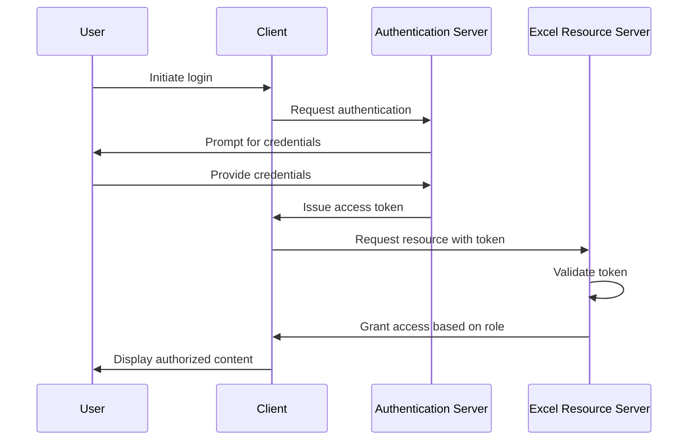

## DATA SECURITY

Excel will implement multiple layers of data security to protect sensitive information:

### Encryption

1. Data at Rest
   - Use AES-256 encryption for local file storage
   - Implement Azure Storage Service Encryption for cloud-stored data

2. Data in Transit
   - Use TLS 1.3 for all network communications
   - Implement Perfect Forward Secrecy (PFS) for enhanced security

3. End-to-End Encryption
   - Offer optional end-to-end encryption for highly sensitive workbooks
   - Implement client-side encryption using the Web Crypto API for the web version

### Data Classification

Implement a data classification system to apply appropriate security measures:

| Classification Level | Description | Security Measures |
|----------------------|-------------|-------------------|
| Public | Non-sensitive data | Standard encryption |
| Internal | Organization-wide data | Access controls, standard encryption |
| Confidential | Sensitive business data | Strong encryption, strict access controls |
| Restricted | Highly sensitive data | End-to-end encryption, MFA required |

### Data Loss Prevention (DLP)

- Integrate with Microsoft 365 DLP policies
- Implement content scanning to detect and protect sensitive information
- Provide alerts and blocking mechanisms for potential data leaks

## SECURITY PROTOCOLS

Excel will adhere to industry-standard security protocols and best practices:

### Secure Development Lifecycle (SDL)

1. Threat Modeling
   - Conduct threat modeling during the design phase
   - Regular updates to threat models as new features are added

2. Code Reviews
   - Mandatory security-focused code reviews
   - Automated static code analysis using tools like Microsoft's SDL Threat Modeling Tool

3. Penetration Testing
   - Regular internal and third-party penetration testing
   - Bug bounty program for responsible disclosure of vulnerabilities

### Compliance and Certifications

- Maintain ISO 27001 certification for information security management
- Comply with GDPR, CCPA, and other relevant data protection regulations
- Adhere to HIPAA requirements for handling healthcare-related data

### Security Monitoring and Incident Response

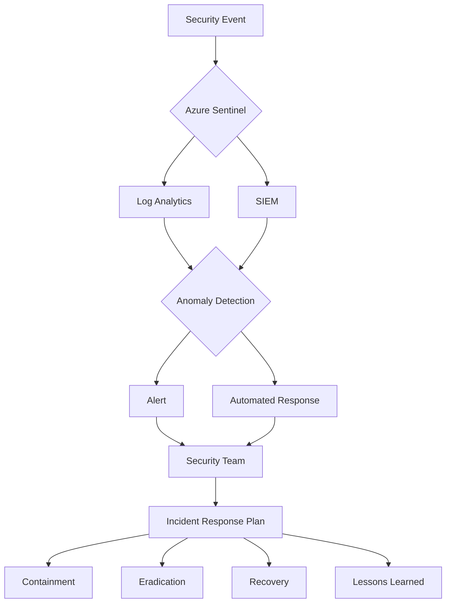

1. Real-time Monitoring
   - Implement Azure Sentinel for advanced threat detection
   - Use Azure Security Center for continuous security assessment

2. Incident Response Plan
   - Establish a clear incident response procedure
   - Regular drills and updates to the incident response plan

3. Patch Management
   - Automated security patch deployment for all Excel components
   - Regular vulnerability assessments and remediation

By implementing these security considerations, Microsoft Excel will provide a secure environment for users to work with their data across all supported platforms, maintaining consistency with the previously mentioned technologies and frameworks.